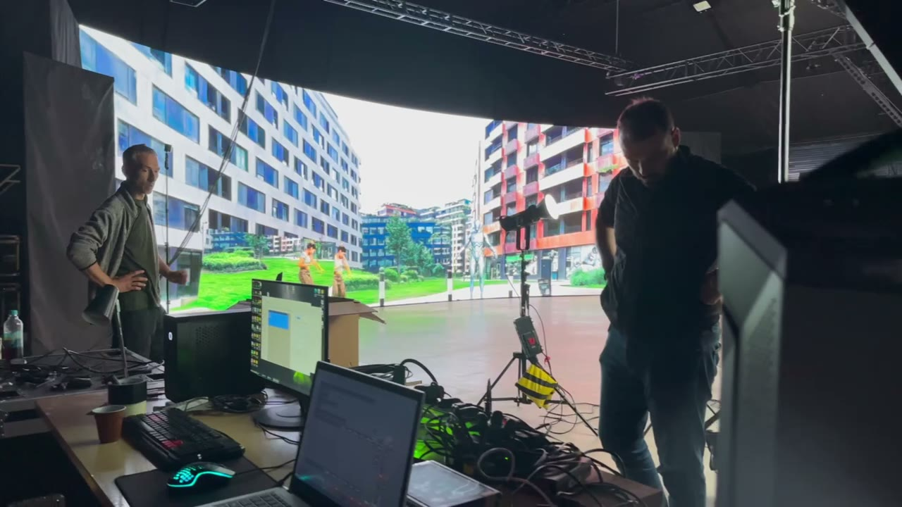
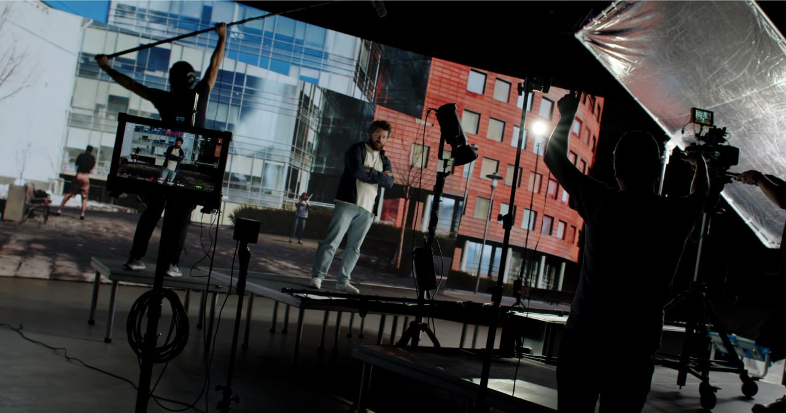

# YaGS · Film XR Edition

**Unreal Engine Plugin for 3D Gaussian Splatting**

> **Platform:** Unreal Engine 5.5 – 5.7
> **Format:** editor and runtime plugin (.uplugin)

> 📦 **The Film XR Edition ships ready-to-use binary releases** of the original [yandex/yags](https://github.com/yandex/yags) plugin (upstream is source-only).
> **[⬇ Download the release for your engine version](https://github.com/filmxr/yags/releases)** — prebuilt for **UE 5.5 / 5.6 / 5.7 (Win64)** — and follow [Installing a Prebuilt Release](#installing-a-prebuilt-release).


▶️ **[Watch the full 1-minute plugin demo (MP4)](docs/media/yags_promo_1min.mp4)**

---

## Table of Contents

- [About](#about)
- [Features](#features)
  - [Import and Export](#import-and-export)
  - [Rendering](#rendering)
  - [Instancing](#instancing)
  - [Scene Editing](#scene-editing)
  - [Color Correction](#color-correction)
  - [Project Settings](#project-settings)
- [System Requirements](#system-requirements)
- [Installing a Prebuilt Release](#installing-a-prebuilt-release)
- [Installation](#installation)
- [Quick Start](#quick-start)
- [Rendering Configuration](#rendering-configuration)
- [Editing Workflow](#editing-workflow)
- [Limitations](#limitations)
- [Backports](#backports)
- [YaGS in Virtual Production](#yags-in-virtual-production)
- [About the Film XR Edition](#about-the-film-xr-edition)

---

## About

**YaGS** is an Unreal Engine plugin for using [3D Gaussian Splatting](https://repo-sam.inria.fr/fungraph/3d-gaussian-splatting/) scenes directly inside a standard UE project: placing 3DGS objects in a level alongside regular polygonal geometry, editing them, and exporting the result.

The key distinction from simple image overlay is **correct depth handling**: splats and polygonal meshes occlude each other according to their actual positions in space, and standard UE post-processing effects (Depth of Field, Motion Blur, TAA/TSR) work correctly when depth rendering is enabled.

---

## Features

### Import and Export

| Operation | Formats |
|---|---|
| Import | `.ply`, `.sog` |
| Export | `.ply` |

- During import, the source color space can be taken into account: **sRGB** or **linear RGB**.
- Imported data is saved as a **UE asset** and can be reused any number of times via the instancing mechanism.

---

### Rendering

- Splats are rendered as **billboard quads** alongside the classic scene.
- Choice of rendering backend:
  - **Mesh Shader** *(default)* — higher performance.
  - **Vertex Shader** — for compatibility.
- Optional **debug overlay**: the outer part of each splat is colored with barycentric coordinates for diagnostics.
- Optional **depth rendering pass** with a configurable alpha cutoff threshold — required for correct Depth of Field, Motion Blur, and temporal reprojection techniques.

---

### Instancing

Multiple copies of the same 3DGS asset in a scene (instances) **do not duplicate splat data in VRAM or RAM** — each instance stores only its transform, individual color correction parameters, and a depth-sort index array (argsort).

- Number of unique objects in a scene: **up to ~60** (64 minus shared buffers).
- Number of instances of one object: **unlimited** (within available VRAM).
- Number of splats in one object: **limited only by VRAM**.

> ⚠️ The ~60 unique object limit does not apply to instances: one object with thousands of instances counts as one unit.

---

### Scene Editing

YaGS provides **invisible region objects** (Volume Actors) of configurable shape for non-destructive editing of a 3DGS scene directly in the UE editor.

**Available region shapes:**

- Box
- Sphere
- Cylinder
- Pyramid
- *(and other primitives from a fixed set)*

**Operations on splats within a region:**

| Operation | Description |
|---|---|
| **Crop** | Keeps only splats inside the region |
| **Cull** | Removes splats inside the region |
| Color Correction | Applies Hue / Saturation / Brightness / Tint / Gamma / Max SH degree / gradient to splats inside the region |

**Merging and exporting the edited scene:**

Multiple 3DGS actors with applied Crop/Cull regions can be **selected together and merged** into a new asset-actor. During the merge:
- positions and scale of the source objects are taken into account,
- all boolean operations are applied (visible splats are included, hidden ones are not),
- color modifications from regions **are not transferred** to the geometry of the new object.

The resulting object is available for **export to `.ply`**.

---

### Color Correction

Each actor (and each instance) supports individual configuration:

| Parameter | Description |
|---|---|
| **Hue** | Hue shift |
| **Saturation** | Saturation |
| **Brightness** | Brightness |
| **Tint** | Color tint (multiplicative) |
| **Gamma** | Gamma correction |

The same parameters, plus **Max SH Degree** and **gradient**, are available for targeted editing via Volume Actors.

---

### Project Settings

All global plugin parameters are accessible at:

```
Project Settings → Engine → YaGS Settings
```

| Parameter | Default | Description |
|---|---|---|
| **Render Backend** | Mesh Shader | Choose between Mesh Shader and Vertex Shader |
| **Render Depth** | Off | Enable splat depth write pass to depth buffer |
| **Depth Alpha Threshold** | `0.0` | Alpha cutoff threshold for depth rendering |
| **Debug Overlay** | Off | Show barycentric coloring of the outer part of splats |
| **SortBatchSizeLog2** | — | GPU sort batch size (log₂, range 0–7); affects GPU sort performance |

---

## System Requirements

| | Minimum | Recommended |
|---|---|---|
| **Unreal Engine** | 5.5 (backport possible) | 5.7.3 |
| **GPU** | DX12 / Vulkan, Mesh Shader support (for Mesh Shader backend) | RTX 3070 / RX 6700 XT or newer |
| **VRAM** | depends on scene size | 8 GB+ |
| **OS** | Windows 10 (DX12) | Windows 11 |

> The Mesh Shader backend requires `D3D12_MESH_SHADER` / `VK_EXT_mesh_shader` support. On GPUs without support, Vertex Shader is used automatically.

---

## Installing a Prebuilt Release

Prebuilt plugin packages for **Windows (Win64)** — with editor and runtime binaries included, **no compilation required** — are published on the [Releases page](https://github.com/filmxr/yags/releases). Each Unreal Engine version has its own release — download the one matching the engine you have installed:

| Your Unreal Engine version | Release to download |
|---|---|
| 5.7.x | [**YaGS 1.0 for UE 5.7**](https://github.com/filmxr/yags/releases/tag/v1.0.0-ue5.7) — `YaGS_UE5.7_Win64.zip` |
| 5.6.x | [**YaGS 1.0 for UE 5.6**](https://github.com/filmxr/yags/releases/tag/v1.0.0-ue5.6) — `YaGS_UE5.6_Win64.zip` |
| 5.5.x | [**YaGS 1.0 for UE 5.5**](https://github.com/filmxr/yags/releases/tag/v1.0.0-ue5.5) — `YaGS_UE5.5_Win64.zip` |

1. Download the archive matching your engine version.
2. Extract it — you get a single `YaGS` folder.
3. Copy the `YaGS` folder into your project's `Plugins` directory (create the directory if it does not exist):

   ```
   MyProject/
   └── Plugins/
       └── YaGS/
           ├── YaGS.uplugin
           ├── Binaries/
           ├── Source/
           └── ...
   ```

   Alternatively, install it engine-wide for all projects: `<UE_Root>/Engine/Plugins/Runtime/YaGS/`.

4. Open your project and enable the plugin:

   ```
   Edit → Plugins → search "YaGS" → enable → restart the editor
   ```

> Because binaries are included, the editor should **not** ask to rebuild the plugin. If it does (engine version mismatch), download the archive matching your engine version or build from source (see [Installation](#installation) below).

---

## Installation

### Option 1 — in the project folder (recommended)

```
MyProject/
└── Plugins/
    └── YaGS/
        ├── YaGS.uplugin
        ├── Source/
        └── ...
```

1. Copy the `YaGS` folder to `<YourProject>/Plugins/`.
2. Open the project in UE — the engine will prompt you to rebuild the plugin.
3. Confirm the build.

### Option 2 — in the engine (for multiple projects)

```
<UE_Root>/Engine/Plugins/Runtime/YaGS/
```

### Enabling the Plugin

```
Edit → Plugins → search "YaGS" → enable → restart the editor
```

---

## Quick Start

### 1. Import a .ply / .sog file

```
Content Browser → right-click → Import → select a .ply or .sog file
```

Or simply **drag the file** into the Content Browser. Double-clicking the asset opens the import settings dialog:

- **Color Space** — select `sRGB` or `Linear` according to the source.
- Confirm the import — the asset will appear in the Content Browser.

### 2. Placing in the Scene

Drag the asset from the Content Browser into the Viewport. The actor will be placed using the object's **convex hull** — collision with the scene is calculated automatically.

> After placement the object can be freely moved, rotated, and scaled with standard UE tools without collision constraints.

### 3. Instancing

To create another copy of an object — simply **drag the same asset** again. The new instance will use the splat data already loaded into VRAM.

### 4. Transform

Scale, position, and rotation of a 3DGS actor are edited with the **same tools** as standard Static Mesh actors:
- `W` — move
- `E` — rotate
- `R` — scale
- etc.

---

## Rendering Configuration

### Enabling Depth Rendering

For correct **Depth of Field**, **Motion Blur**, and temporal techniques (TAA/TSR) during camera movement:

```
Project Settings → Engine → YaGS Settings → Depth Write → true
```

After enabling, configure the threshold:

```
AlphaDepthClip = 0.1  // decrease to "expand" the splat in the depth buffer,
                      // increase to "shrink" it
```

### Choosing the Backend

```
Project Settings → Engine → YaGS Settings → Prefer mesh shader → Mesh Shader / Vertex Shader
```

Mesh Shader provides a performance gain by reducing load on the IA pipeline stage, and the amplification shader culls splats that are "behind the camera". Recommended on modern GPUs (NVIDIA Turing+, AMD RDNA2+).

---

## Editing Workflow

### Boolean Operations with Volume Actors

1. Add a **Gaussian Splatting Boolean Volume** to the scene (`Place Actors → Volumes → Gaussian Splatting Boolean Volume`).
2. Select a shape (`Box`, `Sphere`, `Cylinder`, `Pyramid`, ...) and configure the transform and other geometric parameters.
3. Bind the Boolean Volume to the desired 3DGS actor (or to all objects in the scene) by adding it to the Culls or Crops array:
    - `Cull` — splats inside the region are **removed** from display.
    - `Crop` — splats **outside** the region are removed from display.

> Operations are **non-destructive** — the original asset is not modified; all modifications are stored at the actor level.

### Color Correction via Volume

In the same Volume Actors (`Place Actors → Volumes → Gaussian Splatting Appearance Volume`) you can set color parameters for splats within the region:

- Hue / Saturation / Brightness / Tint / Gamma
- **Max SH Degree** — limits the degree of spherical harmonics (simplifies the angular color dependency)
- **Falloff distance** — applies parameters with a smooth transition at the region boundary

### Merging and Exporting

1. Select multiple 3DGS actors with applied Crop/Cull regions.
2. `Right-click → GAUSSIAN SPLATTING → Fuse actors` — a new actor and corresponding asset will be created, containing only the **visible splats** of all selected objects with their transforms applied.
3. To export the result:
   ```
   Right-click on the new asset in Content Browser → Asset actions → Export... (as .ply)
   ```

---

## Limitations

| Limitation | Value |
|---|---|
| Maximum unique 3DGS objects in a scene | ~60 |
| Maximum instances of one object | unlimited (VRAM) |
| Maximum splats in one object | unlimited (VRAM) |
| Color modifications from Volume Actors | not transferred to geometry on merge |
| Supported runtime platforms | Windows (DX12 / Vulkan) |

---

## Backports

| UE Version | Status |
|---|---|
| 5.7.3 | ✅ Main version |
| 5.7.x | ✅ Can be ported |
| 5.6.x | ✅ Can be ported |
| 5.5.x | ✅ Can be ported |
| 5.4.x and below | ❌ Not supported |

---

## YaGS in Virtual Production

YaGS has been used on real virtual production shoots: 3D Gaussian Splatting environments rendered in Unreal Engine and displayed live on LED-wall stages behind the actors — no green screen, no compositing. The plugin was developed for creating photorealistic digital doubles of real locations for film production; the team behind it describes the technology and its production use in [this article (in Russian)](https://habr.com/ru/companies/yandex/articles/1052328/).

<p align="center">
  
  
</p>
<p align="center">
  
</p>

---

## About the Film XR Edition

**YaGS · Film XR Edition** is a fork of [yandex/yags](https://github.com/yandex/yags) maintained by [Film XR](https://github.com/filmxr). The upstream repository publishes source code only; this edition additionally provides **prebuilt binary releases** for UE 5.5–5.7 and real-world virtual production examples. All plugin code © YANDEX LLC, licensed under the [Apache License 2.0](LICENSE).

---

<p align="center">
  <sub>YaGS — Yet another Gaussian Splatting plugin for Unreal Engine · Film XR Edition</sub>
</p>
